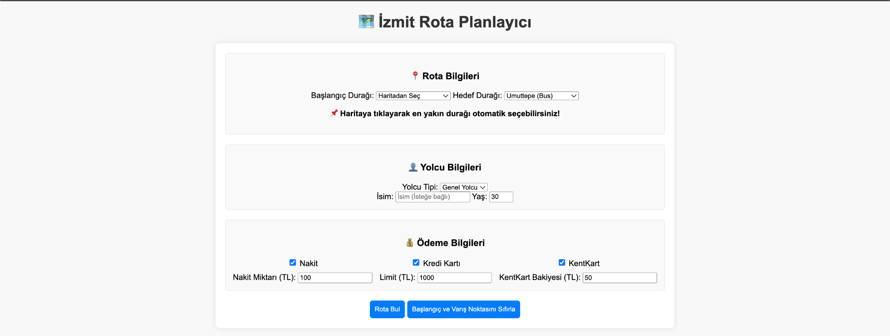
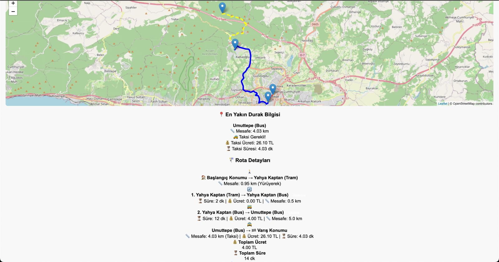
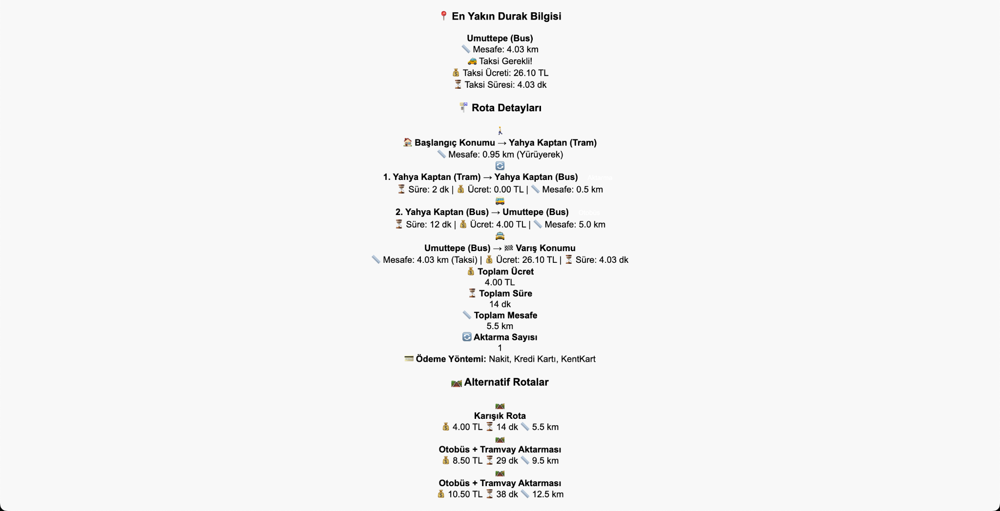

# 🧭 İzmit Ulaşım Rota Planlama Sistemi

Bu proje, Kocaeli ili İzmit ilçesindeki toplu taşıma ve taksi sistemlerini temel alarak kullanıcıların başlangıç konumlarından hedef konumlarına en uygun rotayı belirlemelerini sağlayan web tabanlı bir rota planlama sistemidir. Kullanıcılar, otobüs, tramvay ve taksi gibi ulaşım türlerini içeren farklı senaryoları karşılaştırmalı olarak görüntüleyebilir.

## 🚀 Özellikler

- 🗺 Harita tabanlı durak ve konum seçimi
- 🧑‍🎓 Öğrenci, öğretmen, 65+ gibi yolcu türlerine göre ücretlendirme
- 💳 Nakit, kredi kartı ve KentKart ile ödeme desteği
- 🚌 Otobüs ve 🚋 tramvay entegrasyonu
- 🚖 Taksi entegrasyonu (3 km üzeri mesafelerde zorunlu)
- 🔄 Aktarma (otobüs-tramvay) destekli rota hesaplama
- 🛤 Alternatif rota önerileri (En az aktarma, en ucuz, en kısa vs.)

## 🧱 Kullanılan Teknolojiler

- **Backend:** Python + Flask
- **Frontend:** HTML, CSS, JavaScript
- **Harita:** Leaflet.js + OpenStreetMap
- **Veri Formatı:** JSON (`izmit_data.json`)
- **OOP Yapısı:** Passenger, Transport, Payment sınıfları ve türevleri

## 📸 Ekran Görüntüleri

### 🧾 Kullanıcı Arayüzü – Form Alanı

### 🗺 Harita Üzerinde Rota Görselleştirme

### 📊 Rota Detayları ve Alternatifler

